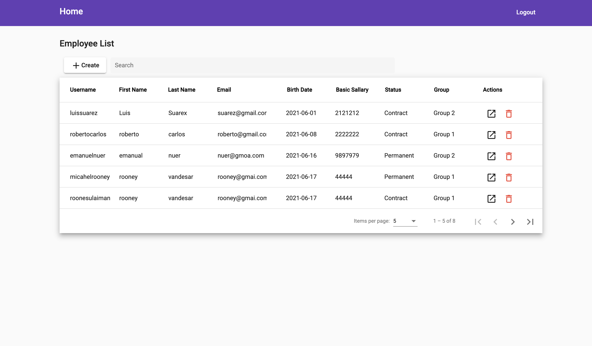
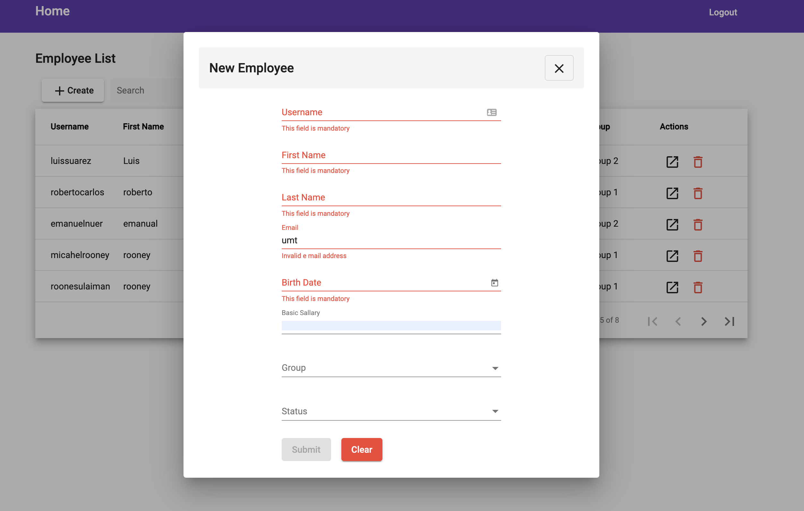

# Website Dahsbord &middot; [](https://www.npmjs.com/package/npm/)
## Project Description

- Create using angular
- Firebase (database)
- Form validation
- Firebase authentication (login)

## Links

- [Repo](https://github.com/AndryanaBaros/angular-technical-firebase)


## Installing / Getting started


open you terminal, and copy this

1. Clone the repo.
```shell
git clone https://github.com/AndryanaBaros/angular-technical-firebase
```
2. Enter the directory project.
```shell
cd angular-technical-test
```
3. Insall Npm Pacakages.
```shell
npm install
```
4. Run this project.
```shell
ng serve
```
5. You can login with this user: 
  - email : baros@baros.com
  - password: qwertyu
  
6. or You can register in Register Page

You must be connected to internet for running the database.

## Screenshots

 




## Built With

- Angular
- Firebase
- Typescript
- Node
- NPM
- HTML
- SASS
- Angular-Material
- Bootstrap


## Author

**Andryana Baros**

- [Profile](https://github.com/andryanabaros "Andryana Baros")
- [Email](mailto:andry.baros@gmail.com?subject=Hi "Hi!")


Give a ⭐️ if you like this project!
